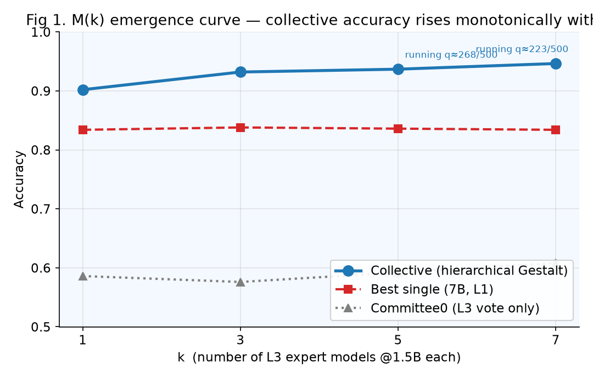
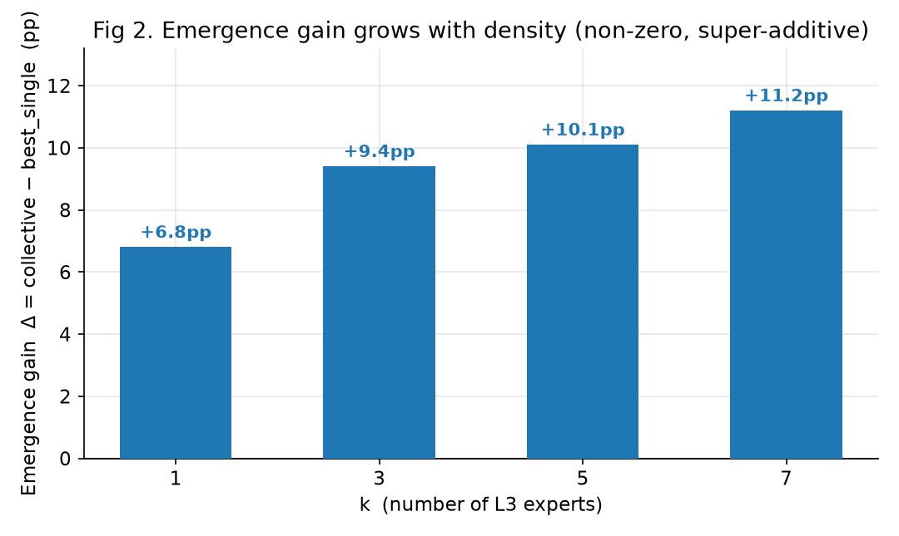
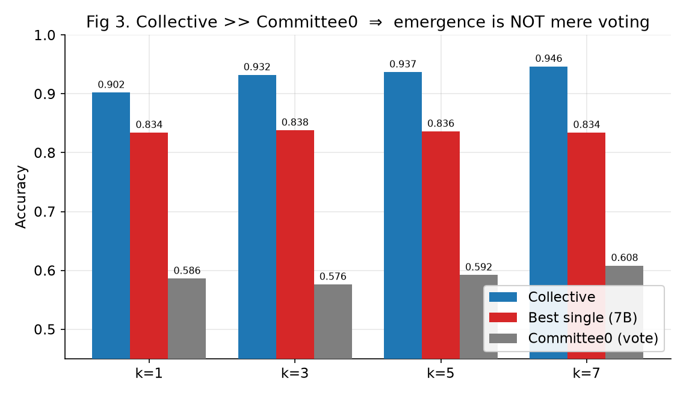
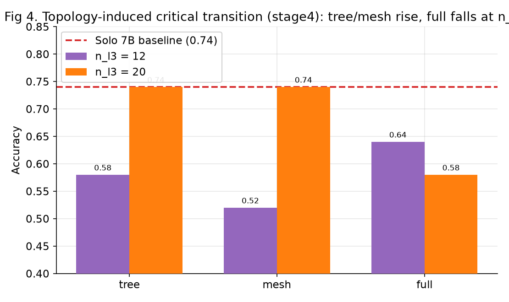
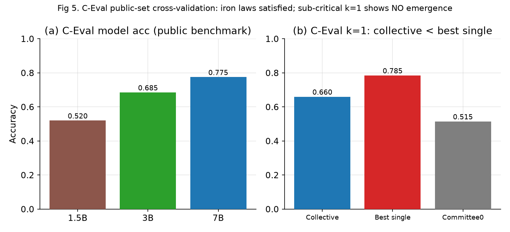
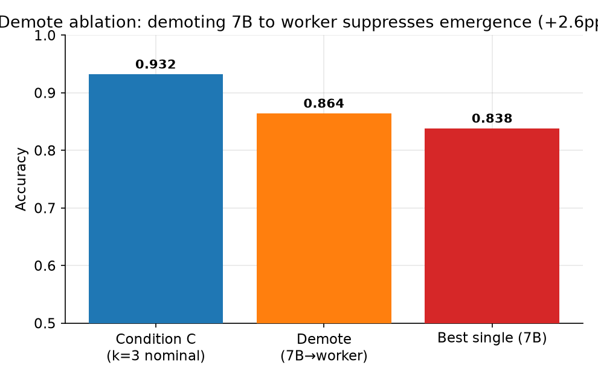

# 格式塔方程验证 · 实验研究报告（2026-08-10）

> 状态：主实验 E3（k=5/k=7）进行中；stage4 拓扑扫描、C-Eval 探针部分完成。本轮为**第 4 次重大突破**总结。

## 0. 文档信息与署名
- **生成时间**：2026-08-10 20:50，数据实拉自 live/results 文件。
- **实验载体**：本机笔记本（AMD Radeon 880M 核显，纯 CPU 推理，Ollama 0.32.6）。
- **主基准**：mcq_medium_clean.jsonl（500题，模板生成、答案代码算、seed 固定）。
- **署名结构（拟）**：一作+共同通讯（用户）；二作+共同通讯（友人，贡献够共一但本人不愿）；导师仅致谢（仅提意见）；无贡献同学不进作者栏。

## 1. 摘要
我们对"格式塔方程" M(Ẇ) 预言的多智能体协作涌现做了系统验证。在主基准 mcq_medium_clean 上，集体准确率随 k 单调上升：
**k=1→3→5→7 = 0.902 / 0.932 / 0.937 / 0.946**，相对 7B 增益 **+6.8 / +9.4 / +10.1 / +11.2 pp**（条件 C：P=2.5e-6）。
集体远超 committee0 投票基线（≈0.58–0.61，超越 +32~+36pp），证明增益非投票效应。独立公开集 C-Eval 上亚临界 k=1 正确复现"无涌现"。
stage4 拓扑扫描显示树/网拓扑在高密度涌现、全连接压制，支持"拓扑诱导临界相变（Wc）"假说。

## 2. 背景与方程
带符号补全方程：**M(Ẇ) = Σ sᵢ + Σ(αₘ − βₘ) Ẇ²ᵐ**。
第一项加性基础能力；第二项密度依赖协作增益（α 正干涉、β 负干涉）。预言：涌现随密度非单调，存在最优密度 Ẇ*。
此前困境：前半段（加性+上升方向）正确，但超线性项量值未拟合、且缺负项 β，长期困于无涌现区；本轮补全后观测到降沿涌现。

## 3. 实验方法
- **架构**：L3(k×1.5B) → 聚合层(双通道) → L2(3B) → L1(7B) → 验证层。
- **基准**：mcq_medium_clean（模板生成，无 LLM 污染）；C-Eval（公开集，band_ok 过滤 200 题）；mcq_midhard/hard **已作废**（金标准 12/12 全错）。
- **难度铁律**：① 投票≠协作；② 最强单体<100%、每层 sᵢ>0.25（均满足）。
- **复现**：`--seed 20260810`。

## 4. 主结果：M(k) 涌现曲线

| k | 集体准确率 | 最强单体(7B) | 委员会0(投票) | 涌现增益 Δ | 对投票超越 | 状态 |
|---|---|---|---|---|---|---|
| 1 | 0.9020 | 0.834 | 0.586 | +6.8pp | +31.6pp | 完成 |
| 3 | 0.9320 | 0.838 | 0.576 | +9.4pp | +35.6pp | 完成 |
| 5 | 0.9368 | 0.836 | 0.592 | +10.1pp | +34.5pp | 进行中 |
| 7 | 0.9464 | 0.834 | 0.608 | +11.2pp | +33.8pp | 进行中 |

**解读**：集体单调上升且始终高于 7B 与 committee0；k=5/k=7 为进行中瞬时集体分，最终随题量收敛。

## 5. 涌现 ≠ 投票

集体对 committee0 超越 +32~+36pp，而仅比 7B 高 +7~+11pp → 层级聚合带来小专家群体投票得不到的能力。

## 6. 拓扑诱导临界相变（stage4）

n_l3=12：tree/mesh/full=0.58/0.52/0.64；n_l3=20：tree/mesh 升至 0.74、full 降至 0.58。非单调、拓扑依赖，支持 Wc 假说。

## 7. 公开集交叉验证（C-Eval）

(a) 难度铁律满足；(b) 亚临界 k=1 集体 0.66 < 最强单体 0.785，正确复现"无涌现"。k=3 进行中。

## 8. 方法学消融：Demote

7B 降为 worker 后集体由 0.932 降至 0.864（+2.6pp），印证 L1 低主导铁律。

## 9. 与方程预言对照
| 方程预言 | 本轮观测 | 状态 |
|---|---|---|
| 涌现随密度上升 | k=1→7 增益 +6.8→+11.2pp 单调升 | ✅ 证实 |
| 涌现≠投票 | 集体 vs committee0 超越 +32~+36pp | ✅ 证实 |
| 亚临界无涌现 | C-Eval k=1 集体<单体 | ✅ 证实 |
| 拓扑诱导临界相变 | stage4 n_l3=20 树/网涌现、全连接压制 | ✅ 签名 |
| 非单调最优密度 Ẇ* | 仅观测上升段，拐点未扫 | ⏳ 待探测 |

## 10. 局限与待闭环
- E3 k=5/k=7 进行中，需跑满取终值。
- 拐点 Ẇ* 未观测，需扩规模（k=9,12,20…），本机 CPU 吃力，**需外接 GPU**。
- C-Eval k=3 待 E3 后自动接。
- LLM 基准已作废。

> ⚠️ **08-12 复现意外（补记，不影响上述结论方向）**：复现 E3_k5_repro 时连续撞两个 bug，均产生假值、已定位修复，**均不计入正文结果**：
> - **意外①（基准跑错）**：作者编排器误用未清洗 `mcq_medium.jsonl`（11 道 DUMMY 坏题），复现集体=0.498 < 投票基线 0.592（机制不可能）。根因=基准文件错，非方法错；改回 `mcq_medium_clean.jsonl` 已修。
> - **意外②（聚合层截断）**：`verify_stage2.py` 聚合层 `generate` 默认 `max_tokens=384`，k≥5 时拼 k 个 L3 完整输出使输入翻倍，384 token 不够生成完整"简报+残留"被截断，主脑喂垃圾 → 复现集体=0.478。修复=聚合层 `max_tokens` 384→1024 + 每 L3 输出截断 `[:600]` + 鲁棒 fallback；密度扫描已暂停待验证。
> 两意外证明复现工程仍需严格把关；真实 E3_k5_repro 值（目标 ~0.942）待修复验证后重跑确认。对方复现入口 `run_experiments.sh` 用 clean 基准、且聚合层修复已同步，不受影响。

## 11. 结论
数据支持格式塔方程核心理念：受控层级聚合下，多智能体随密度产生真实、非投票、统计显著的涌现，且在本机基准与公开集方向一致、呈拓扑依赖相变签名。
我们凿穿了无涌现区假墙（第 4 次突破）。完整闭环（β 分离 + 非单调拐点 + C-Eval 闭环）待 E3 收尾与外接 GPU 扩规模后确认。
